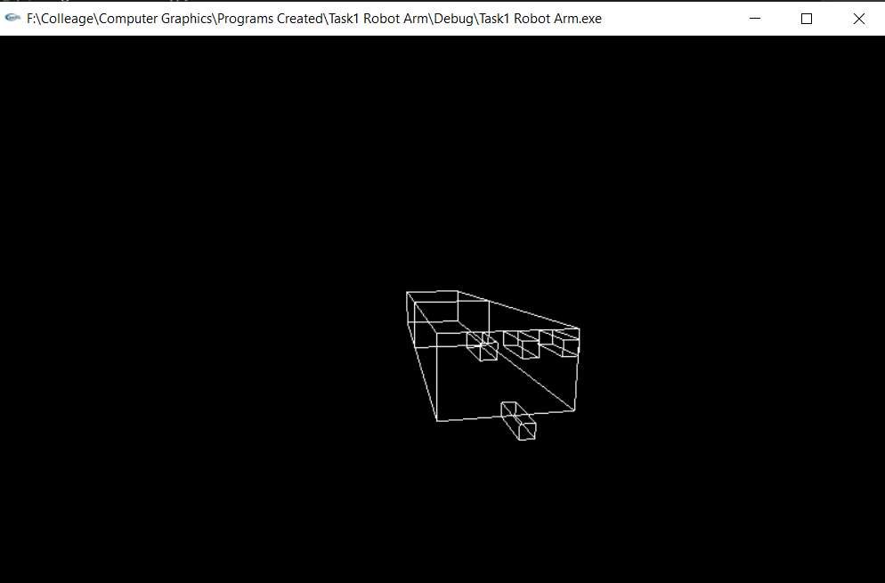

# Full_Robot_Arm_OpenGL
A Program with openGL that creates a full robot arm with motions and limitations to simulate the real one.

## Drawing Robot Arm Fingers: <br>

<p>First We needed to draw the shoulder and the elbow of the arm with the help of Push and Pop Matrix.<br>

 <br>

after drawing the first two blocks and poping the last state; <br>
so we are now able to go through and draw the base fingers As shown.<br>

---

The mid One: <br> <br>
 <br>

```C++
    glTranslatef(1.0, 0.0, 0.0);
    glRotatef((GLfloat)fingerBase, 0.0, 0.0, 1.0);
    glTranslatef(0.15, 0.25, 0.0);
    glPushMatrix();
    glScalef(0.3, 0.1, 0.1);
    glutWireCube(1);
    glPopMatrix();
```

> The first line to translate again in x-axis. <br>
> The third one is to position it in the right location to be in the center of the top of the block by moving some in Y direction and some in X-direction.

---

The most Left one: <br> <br>
 <br>

```c++
    glRotatef((GLfloat)fingerBase, 0.0, 0.0, 1.0);
    glTranslatef(0.0, 0.0, 0.25);
    glPushMatrix();
    glScalef(0.3, 0.1, 0.1);
    glutWireCube(1);
    glPopMatrix();
```

> The second line to just move the finger in the z direction to be the left most one.

---

The most Right one: <br> <br>
 <br>

```c++
    glRotatef((GLfloat)fingerBase, 0.0, 0.0, 1.0);
    glTranslatef(0.0, 0.0, -0.5);
    glPushMatrix();
    glScalef(0.3, 0.1, 0.1);
    glutWireCube(1);
    glPopMatrix();
```

> The second line to move the finger back in the z direction to be the right most one.

---

The down one: <br> <br>
 <br>

```c++
    glRotatef((GLfloat)fingerBase, 0.0, 0.0, 1.0);
    glTranslatef(0.0, -0.5, 0.25);
    glPushMatrix();
    glScalef(0.3, 0.1, 0.1);
    glutWireCube(1);
    glPopMatrix();
```

> The second line to move the finger down in the y direction and adding move in z to return to the center place.

---

> Note That for drawing the first base finger which was the middle:
> we needed to translate some distance in x-axis and for the rest of the base ones we didn't translate in X direction,
> they were just moved in Z direction and for the down one we needed to change the Y-Value.

---

Then we needed to draw the up ones by the same way with translating the first one in X and the others are just translated in Y and Z, this will be explained.<br> <br>

```c++
    //Draw finger flangup 1 down
    glTranslatef(0.15, 0.0, 0.0);
    glRotatef((GLfloat)fingerUp, 0.0, 0.0, 1.0);
    glTranslatef(0.15, 0.0, 0.0);
    .
    .
    .

    //Draw finger flangup 2  mid
    glRotatef((GLfloat)fingerUp, 0.0, 0.0, 1.0);
    glTranslatef(0.0, 0.5, 0.0);
    .
    .

    //Draw finger flangup 3 most right
    glRotatef((GLfloat)fingerUp, 0.0, 0.0, 1.0);
    glTranslatef(0.0, 0.0, 0.25);
    .
    .

    //Draw finger flangup 4 most left
    glRotatef((GLfloat)fingerUp, 0.0, 0.0, 1.0);
    glTranslatef(0.0, 0.0, -0.5);
    .
    .
```

<br>

> for the first one the Current Matrix was already at the base down finger coordinates so we can translate just in x direction to draw the first up finger to be the down one as in the second line of code. <br>
> then again changing the y and z indices to draw the last three ones.<br>

<br>

<br>

</p>

---

## Rotation and Angels

### the Angeles

after some testing on the code; we managed that this angles were good enough to simulate human arm.

shoulder: -80 -> 60

elbow: 0 -> 160

for the FingerBase and FingerUp ranges it was kinda tricky as they are related to each other and if the fingerBase rotated then there will be some **limition** on the FingerUp rotation and vice-versa.
and this table demonstrate the 0 -> max-Rotation of both FingerBase and FingerUp based on each other


| FignerBase | FignerUp |
| :--------- | -------: |
| 0          |      -45 |
| -5         |      -35 |
| -10        |      -25 |
| -15        |      -15 |
| -20        |       -5 |

> for example if the FingerBase angel is -10 then the max-Rotation for FingerUp will be 0 -> - 25

so we had to come up with mathematical formula to calculate the max-rotation for Finger parts based on the other part.

``` c++
 -((fingerUp + 45) / 2)
```

this formula calculate the max-rotation for FingerBase based on the value of FingerUp

```c++
 -45 - 2 * fingerBase
```

and this formula calculate the max-rotaion for FingerUp based on the value of FingerBase

### Problems

the rotation of each finger was in diffrent speed of rotation despite using one rotate calling for each finger.
until we realised the calling of the rotation funtion can effect more than one object so we used only one rotation function for the fingers we want it to rotate with each other and seprate them from the others using push and pop for the matrix.

> Final Design 

